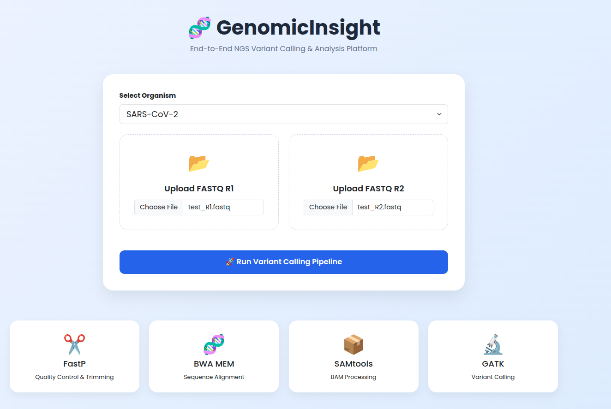
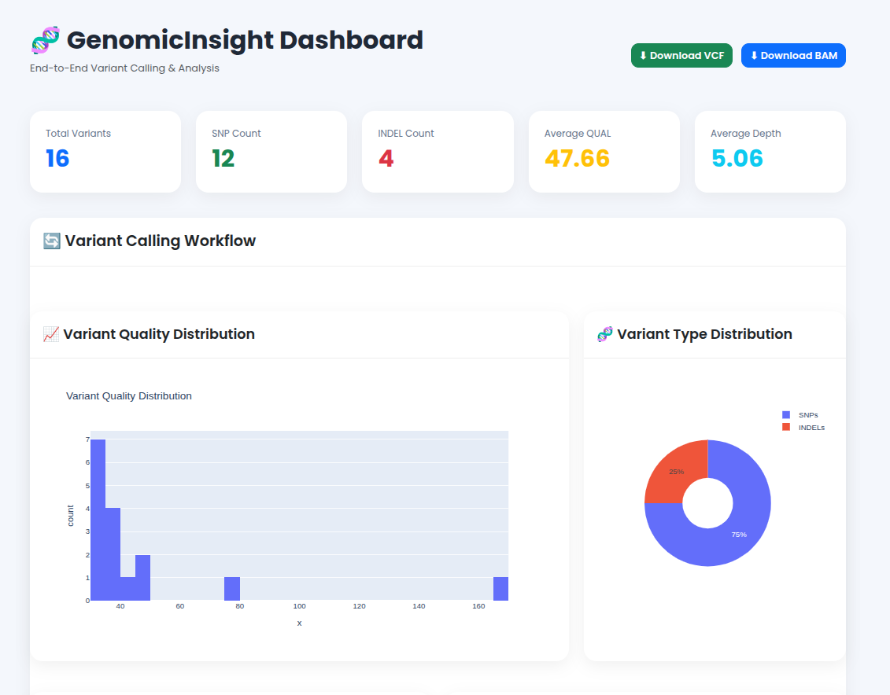
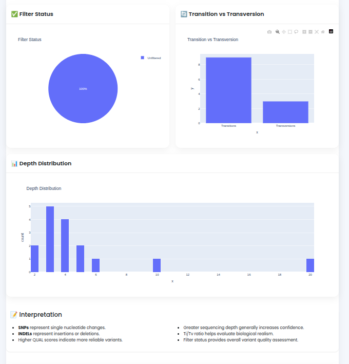
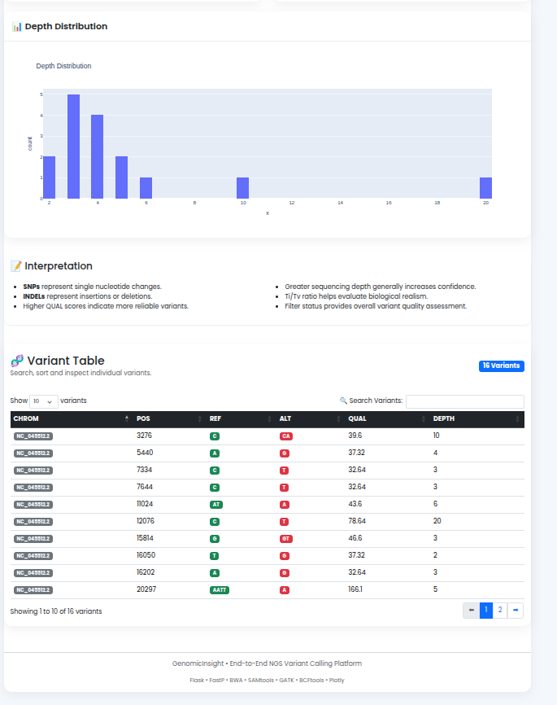

# 🧬 GenomicInsight: End-to-End NGS Variant Calling & Analysis Platform

> A Docker-powered web application for performing end-to-end Next Generation Sequencing (NGS) variant calling and interactive variant analysis.

---

## 📖 Overview

**GenomicInsight** is a Flask-based bioinformatics platform that automates the complete variant calling workflow from raw paired-end FASTQ files to interactive visualization of genomic variants.

The platform integrates industry-standard bioinformatics tools inside Docker containers, allowing users to perform sequence alignment, variant calling, and downstream analysis without installing individual bioinformatics software locally.

Currently, the platform supports:

* 🧫 **Escherichia coli**
* 🦠 **SARS-CoV-2**

---

# 🚀 Features

### Web Interface

* Upload paired-end FASTQ files
* Organism selection
* One-click pipeline execution
* Download generated BAM and VCF files

### Variant Calling Pipeline

* FastP (Quality Control & Trimming)
* BWA-MEM (Sequence Alignment)
* SAMtools (BAM Processing)
* GATK MarkDuplicates
* GATK HaplotypeCaller
* BCFtools (Variant Analysis)

### Interactive Dashboard

* Total Variant Count
* SNP Count
* INDEL Count
* Average Variant Quality (QUAL)
* Average Read Depth
* Variant Quality Distribution
* SNP vs INDEL Distribution
* Transition vs Transversion Analysis
* Filter Status Distribution
* Depth Distribution
* Searchable Variant Table
* Pagination for Large VCF Files

---

# ⚙️ Pipeline Workflow

```text
Paired-End FASTQ
        │
        ▼
     FastP
(Quality Control)
        │
        ▼
     BWA-MEM
(Read Alignment)
        │
        ▼
    SAMtools
SAM → BAM → Sort
        │
        ▼
 GATK MarkDuplicates
        │
        ▼
GATK HaplotypeCaller
        │
        ▼
     variants.vcf
        │
        ▼
     BCFtools
 Variant Statistics
        │
        ▼
 Flask Dashboard
```

---

# 🏗️ Project Architecture

```text
                User
                 │
                 ▼
        Flask Web Application
                 │
        Upload FASTQ Files
                 │
                 ▼
        Docker Containers
                 │
     ┌───────────┼───────────┐
     │           │           │
   FastP       BWA       SAMtools
                 │
                 ▼
              GATK
                 │
                 ▼
            variants.vcf
                 │
                 ▼
            BCFtools
                 │
                 ▼
      Interactive Dashboard
```

---

# 🛠️ Technologies Used

## Backend

* Python 3
* Flask

## Bioinformatics Tools

* FastP
* BWA-MEM
* SAMtools
* GATK
* BCFtools

## Visualization

* Plotly
* Bootstrap 5
* HTML5
* CSS3

## Containerization

* Docker

---

# 🐳 Docker Images Used

| Tool     | Docker Image                                    |
| -------- | ----------------------------------------------- |
| FastP    | biocontainers/fastp:v0.19.6dfsg-1-deb_cv1       |
| BWA      | quay.io/biocontainers/bwa:0.7.19--h577a1d6_1    |
| SAMtools | quay.io/biocontainers/samtools:1.21--h96c455f_1 |
| GATK     | broadinstitute/gatk:latest                      |
| BCFtools | staphb/bcftools:latest                          |

---

# 📂 Project Structure

```text
NGS-Variant-Analysis-Dashboard/
│
├── app.py
├── Linux_processes/
│   ├── Variant_calling_pipeline.py
│   └── Variant_analysis.py
│
├── templates/
│   ├── index.html
│   └── variant_analysis_result.html
│
├── static/
│
├── ref_seq/
│   ├── E_Coli/
│   └── sars_cov_2/
│
├── Screenshots/
│
└── uploads/
```

---

# 📸 Screenshots

## Landing Page



---

## Dashboard Overview



---

## Variant Analysis



---

## Variant Table



---

# 🚀 Installation

## Clone Repository

```bash
git clone https://github.com/rahuls472/NGS-Variant-Analysis-Dashboard.git

cd NGS-Variant-Analysis-Dashboard
```

---

## Create Python Environment

```bash
conda create -n ngs_dashboard python=3.12

conda activate ngs_dashboard
```

---

## Install Python Packages

```bash
pip install flask plotly pandas werkzeug
```

---

## Install Docker

Install Docker Desktop (Windows) or Docker Engine (Linux).

Verify installation

```bash
docker --version
```

---

## Pull Required Docker Images

```bash
docker pull biocontainers/fastp:v0.19.6dfsg-1-deb_cv1

docker pull quay.io/biocontainers/bwa:0.7.19--h577a1d6_1

docker pull quay.io/biocontainers/samtools:1.21--h96c455f_1

docker pull broadinstitute/gatk:latest

docker pull staphb/bcftools:latest
```

---

## Download Reference Genome

Download and index the reference genomes for:

* Escherichia coli
* SARS-CoV-2

Place them inside the `ref_seq/` directory.

---

## Run the Application

```bash
python app.py
```

Open your browser

```text
http://127.0.0.1:5000
```

---

# 📊 Dashboard Outputs

The dashboard provides:

* Variant Quality Histogram
* SNP vs INDEL Pie Chart
* Filter Status Distribution
* Transition vs Transversion Analysis
* Read Depth Histogram
* Interactive Variant Table
* Search Functionality
* Pagination
* BAM Download
* VCF Download

---

# 🎯 Motivation

Bioinformatics pipelines often require multiple command-line tools and can be challenging for beginners to use. This project was developed to simplify the variant calling workflow by providing an intuitive web interface while leveraging Docker containers to ensure reproducibility and eliminate dependency conflicts.

---

# 🔮 Future Enhancements

* User Authentication
* Multi-sample Processing
* Batch Analysis
* Variant Annotation (ANNOVAR / VEP)
* Functional Enrichment Analysis
* PDF Report Generation
* Cloud Deployment
* Nextflow Workflow Integration
* RNA-Seq Analysis Pipeline
* Real-time Pipeline Progress Tracking

---

# 👨‍💻 Author

**Rahul Kumar Singh**

M.Sc. Bioinformatics

GitHub: https://github.com/rahuls472


---

# ⭐ Support

If you found this project useful, please consider giving it a ⭐ on GitHub. Your support helps increase the visibility of the project and motivates further development.
